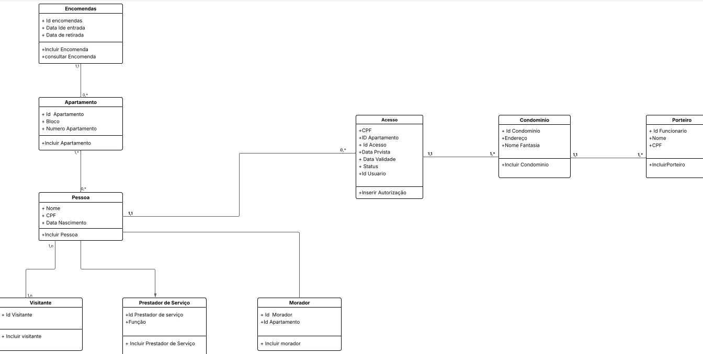

# Sistema de Gestão de Condomínio 🏢

## 📌 Sobre o Projeto
O **Sistema de Gestão de Condomínio** é uma aplicação voltada para facilitar e agilizar o controle de acesso e o gerenciamento de rotinas diárias (como o recebimento de encomendas) em condomínios residenciais. 

Este projeto foi desenvolvido como trabalho da disciplina de **Programação Orientada a Objetos (POO)**, ministrada pela professora Alexandra, no curso Técnico em Desenvolvimento de Sistemas do **Instituto Federal de São Paulo (IFSP) - Câmpus Guarulhos**.

## 💻 Tecnologias e Conceitos Utilizados
* **Linguagem:** `PHP`
* **Paradigma:** Programação Orientada a Objetos (POO)
* **Modelagem:** Diagrama de Classes (UML)
* **Conceitos Aplicados:** Herança, Polimorfismo, Encapsulamento e Abstração.

## ⚙️ Funcionalidades e Histórias de Usuário
O sistema foi modelado para atender às necessidades de diferentes atores do condomínio (Morador, Porteiro, Visitante e Prestador de Serviço), entregando as seguintes funcionalidades:

* **Controle de Acesso Rápido:** Entrada agilizada para moradores cadastrados.
* **Gestão de Encomendas:** Registro de entrada e retirada de pacotes, permitindo que o morador saiba quando buscar suas entregas.
* **Pré-Autorização de Visitas:** Moradores podem cadastrar previamente seus visitantes e prestadores de serviço, evitando filas e tumultos na portaria.
* **Painel da Portaria:** O porteiro possui visibilidade antecipada de quem chegará ao condomínio, facilitando o controle e a segurança.
* **Gestão de Contatos:** Sistema para manter o contato dos moradores sempre atualizados, facilitando a comunicação da portaria.

## 📐 Estrutura e Modelagem
A arquitetura do sistema foi baseada em um diagrama de classes bem estruturado, onde a classe base `Pessoa` distribui herança para os perfis específicos da aplicação. As principais entidades do sistema incluem:

* `Condominio`, `Bloco` e `Apartamento`
* `Pessoa` (Classe Mãe) ➡️ `Morador`, `Porteiro`, `Visitante`, `Prestador de Serviço`
* `Acesso` (Controle de permissões, datas previstas e validade)
* `Encomendas` (Registro de rastreio interno)

## 👥 Equipe Desenvolvedora
* **Mariana Nogueira Neves**
* **Victor Magno de Freitas**
* **Jonatas Bandeira Alves**
